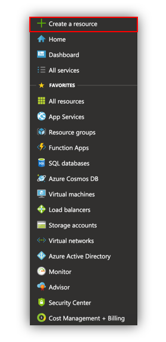
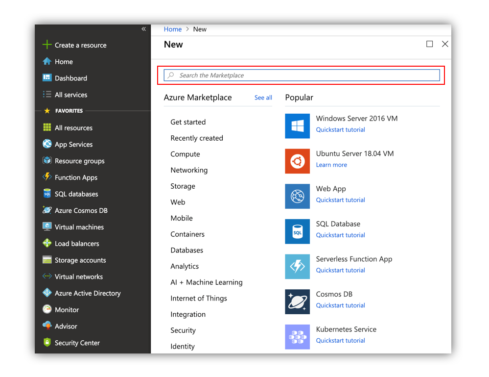
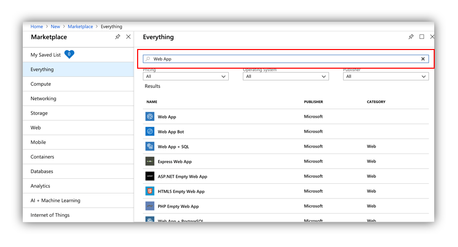
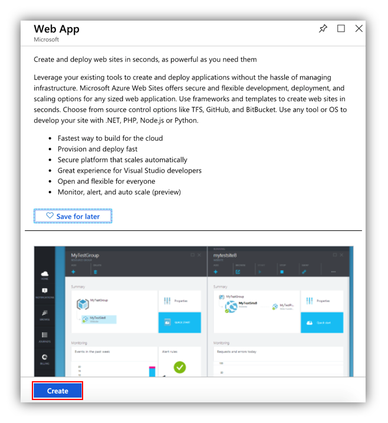
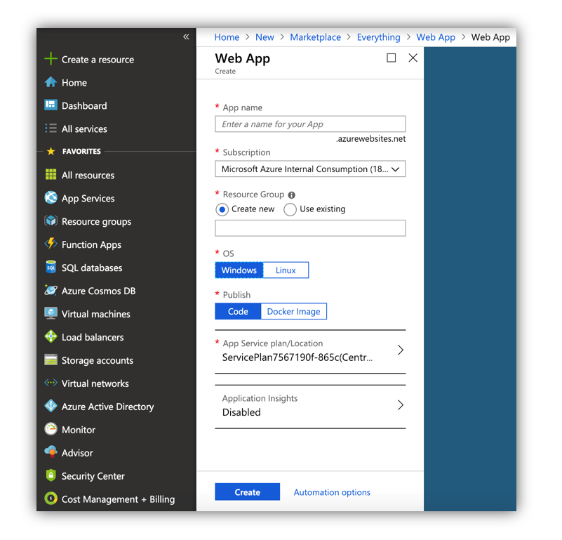
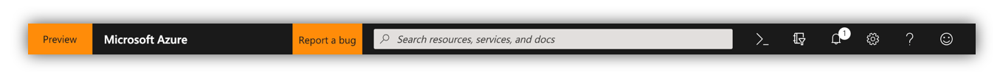
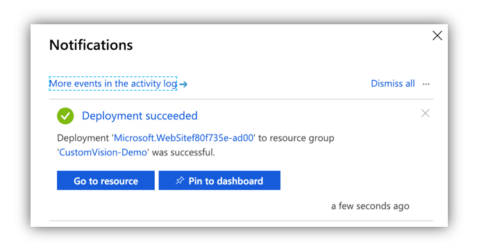

<h1># Custom Vision Model in Web App</h1>
This tutorial demonstrates how you can use a Custom Vision Model in a Web App using JavaScript (<a href="https://customvision.ai/">XMLHttpRequest</a>). 
In the first step you create a Custom Vision Model [1]. After that we integrate our Model into an Azure Web Service [2].
At the end we can take/upload an image in our Web App to use our Custom Vision Model to execute a prediction.  

[1] <a href="https://customvision.ai/">Custom Vision</a> 
[2] <a href="https://azure.microsoft.com/en-us/services/app-service/web/">Azure Web App</a>

### Prerequisites
<ul>
  <li>Custom Vision Model</li>
</ul>

### 1. Create Custom Vision Model

<a href="https://docs.microsoft.com/en-us/azure/cognitive-services/custom-vision-service/getting-started-build-a-classifier">How to build a classifier with Custom Vision</a> 

### 2. Create Web App Service

#### Create Web App Ressource in the Azure Portal

Go to the <a href="portal.azure.com">Azure Portal</a> and "Create a resource". You can see the field on the left side.

After clicking the button "Create a resource" you will see the following screen.

In the search box enter "Web App" and you get the all results. Select the first result "Web App" by clicking.

After that you will see the following screen. Click the "Create" button to create the Web App.

You have to define the following fields:
<ul>
  <li><b>App name:</b>  Name of your App</li>
  <li><b>Subscription:</b>  Select your Subscription</li>
  <li><b>Resource Group:</b>  A resource group is a container that holds related resources for an Azure solution. In Azure, you group related resources such as storage accounts, virtual networks, and virtual machines (VMs) to manage them as a single entity.</li>
  <li><b>Operating system (OS): </b> You can decide between Windows and Linux</li>
  <li><b>Publish (Code or Docker):</b>  You can decide between Code and Docker Image</li>
  <li><b>App service plan:</b>  
  An App Service Plan consists of the underlying virtual machines that will host the Azure App Services. It has several tiers, from Free to Premium. 

  The App Service Plan defines the region of the physical server where your app will be hosted on and the amount of storage, RAM, and CPU the physical servers will have.</li>
  <li><b>Application insights:</b> Telemetry and Analytics of the App </li>
</ul>

After that click "Create" to finish your creation. By clicking the bell on the top right corner you will see the progress of the creation.

You will receive notification if the deployement is succeeded!

### 3. Publish Code to Azure App Service

Copy the link in the GitHub Repository and follow the steps in the video below.

### 4. Change Keys in the source code

#### Change the Prediction URL and the Prediction Key

You will get these two infromation from the <a href="https://www.customvision.ai">Custom Vision Portal.</a> 
Go to the "App Service Editor (Preview)" and click "Go".

Open the "index.html" file and insert the "Prediction URL" and the "Prediction Keys". (Line 231 - 240)

### 5. Make predictions

#### Make predictions with a local file

Go to your Web App, select an image and click the "Prediction" button. Or use your Phone to select an image with your camera.

#### Make predictions with an image from your camera

